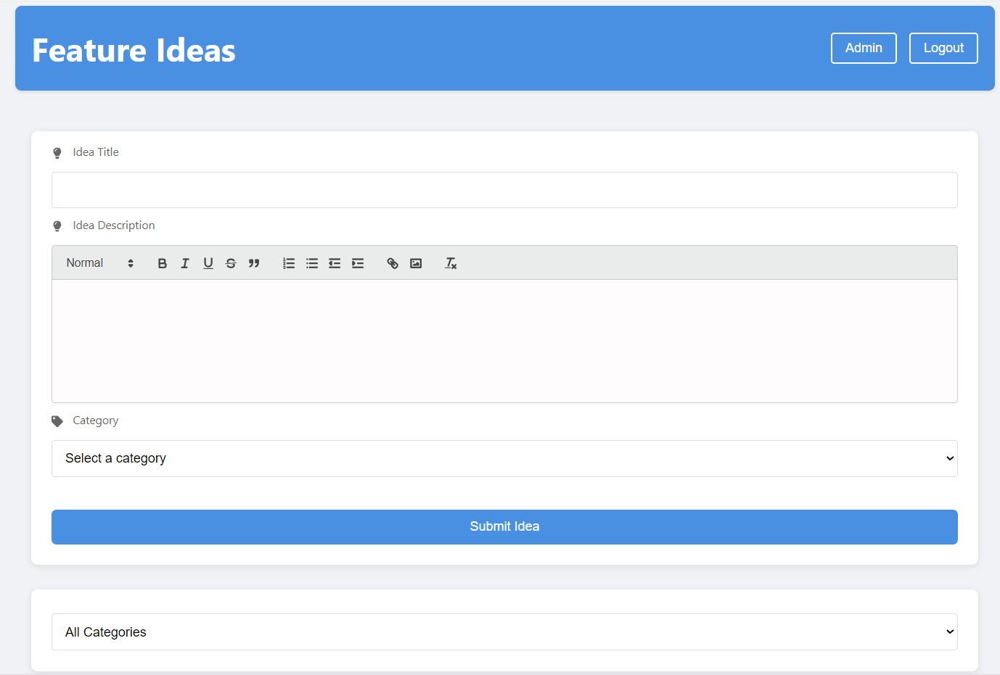
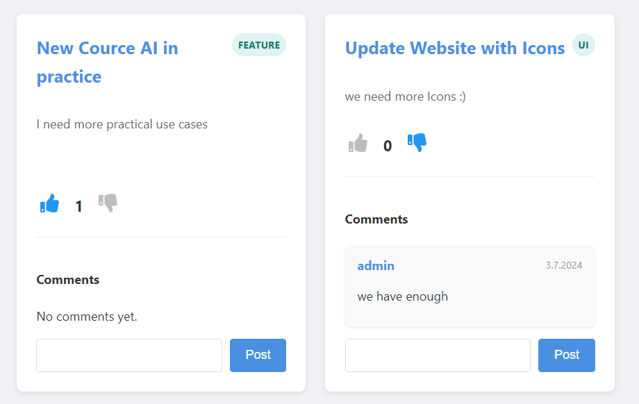

# Feature Vote Platform

## Description
Feature Ideas Platform is a web application that allows users to submit, vote on, and discuss feature ideas for products or services. It provides a collaborative space for users to share their innovative thoughts and engage in meaningful discussions about potential improvements.

## Features
- User authentication (register, login, logout)
- Submit new feature ideas
- Vote on existing ideas
- Comment on ideas
- Categorize ideas
- Admin panel for idea management
- Responsive design for mobile and desktop

### Main Page

### Feature Idea Cards

## Technologies Used
- Frontend: React.js
- Backend: Node.js with Express.js
- Database: SQLite
- State Management: React Hooks
- Styling: CSS3 with Flexbox and Grid
- Icons: React Icons
- Rich Text Editor: React Quill

## Installation

1. Clone the repository
git clone https://github.com/yourusername/feature-ideas-platform.git

2. Navigate to the project directory
cd feature-ideas-platform

3. Install dependencies for both frontend and backend

npm install
cd client && npm install

Create a `.env` file in the root directory and add your environment variables
PORT=5000
NODE_ENV=development

5. Start the development server
npm run dev

## Usage
After starting the development server, open your browser and navigate to `http://localhost:3000`. You can register a new account or log in with an existing one to start submitting and voting on ideas.

## Contributing
Contributions are welcome! Please feel free to submit a Pull Request.

## Acknowledgments
- React.js documentation
- Node.js and Express.js documentation
- SQLite documentation
- React Quill for the rich text editor
- React Icons for the icon set

Project Link: [https://github.com/storminator89/feature-vote-app](https://github.com/storminator89/feature-vote-app)

